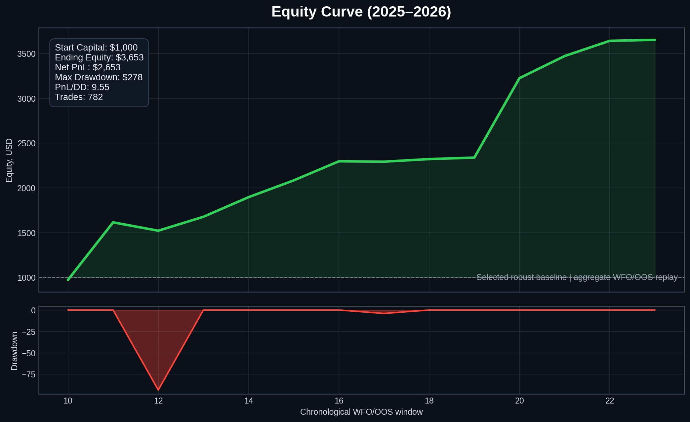
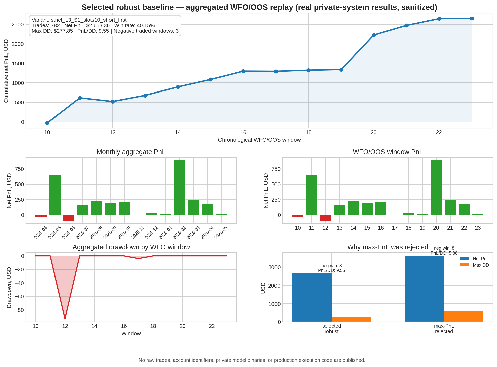

# Market Signal Lab

This repository presents the public research layer of a proprietary crypto-perpetual trading system. It contains aggregate validation statistics, architecture notes, monitoring design, and a reproducible reporting layer derived from a real private research and paper/live workflow.

It does not publish raw market data, private feature code, model binaries, live logs, account identifiers, or production exchange adapters.


## Technology Stack

- Python
- Pandas
- NumPy
- Scikit-learn
- XGBoost
- LightGBM / CatBoost style ensemble workflow
- Docker
- AsyncIO
- WebSocket / REST market-data polling
- Binance Futures / crypto-perpetual exchange APIs
- Walk-forward validation
- Feature engineering
- Risk management
- Monitoring pipeline

## What this repo shows

- A research-to-runtime workflow for short-horizon crypto perpetual signals.
- Real aggregate WFO/OOS replay results from the private system.
- Why the selected baseline was chosen for robustness rather than highest aggregate PnL.
- How model signals connect to risk controls, paper/live ledgers, parity checks, and monitoring.
- What is deliberately withheld to avoid leaking private alpha or operational secrets.

## Headline aggregate results

Selected baseline: `strict_L3_S1_slots10_short_first`.

| Metric | Value |
|---|---:|
| Public evaluation period | 2025-04 to 2026-05 |
| WFO/OOS aggregate trades | 782 |
| Net PnL | $2,653.36 |
| Start capital reference | $1,000.00 |
| Ending equity reference | $3,653.36 |
| Win rate | 40.15% |
| Max drawdown | $277.85 |
| PnL / DD | 9.55 |
| Traded windows | 14 |
| Negative traded windows | 3 |
| Worst window PnL | -$93.39 |
| Best window PnL | $887.97 |

Important: these are historical replay/paper-style aggregate results from the private research system, not a promise of future performance.





## Robustness over max-PnL cherry-picking

A higher aggregate-PnL variant existed, but it was rejected because robustness was weaker:

| Variant | Net PnL | Max DD | Negative windows | PnL/DD | Decision |
|---|---:|---:|---:|---:|---|
| `strict_L3_S1_slots10_short_first` | $2,653.36 | $277.85 | 3 | 9.55 | selected |
| `pnl_L3_S3_slots10_short_first` | $3,606.41 | $613.23 | 8 | 5.88 | rejected |

The goal was not to show the prettiest backtest. The goal was to select a baseline that survived out-of-sample windows with lower drawdown and fewer bad windows.

## Alpha thesis

The hypothesis is **not** that a generic ML model can magically predict crypto direction. The thesis is that short-horizon crypto perpetual markets periodically exhibit forced-flow imbalances: open-interest expansion/compression, funding dislocation, volatility clustering, liquidation-like moves, and regime-dependent continuation/exhaustion behavior.

The model/ranking layer selects candidates, but the risk/execution layer decides whether a trade is admissible.

See [docs/11-alpha-thesis.md](docs/11-alpha-thesis.md).

## Public/private boundary

Published here:

- aggregate metrics by WFO window, month, and side;
- architecture and runtime diagrams;
- alpha thesis and research notes;
- reporting script that regenerates public charts from aggregate CSVs;
- documentation of validation, risk, monitoring, and limitations.

Not published:

- raw historical data / DBs / parquet files;
- live or paper trade logs with raw timestamps/prices/order identifiers;
- private feature formulas and exact signal implementation;
- model binaries, calibrators, and full production configs;
- exchange adapters, credentials, account IDs, Telegram/webhook targets;
- private git history.

See [docs/publication_allowlist.md](docs/publication_allowlist.md).

## Repository map

```text
reports/
  case_study_metrics.csv              # real aggregate selected-baseline metrics
  case_study_wfo_window_summary.csv   # real aggregate per-window metrics
  case_study_monthly_summary.csv      # real aggregate monthly metrics
  case_study_side_summary.csv         # real aggregate LONG/SHORT metrics
  robustness_comparison.csv           # selected baseline vs rejected max-PnL variant
  post_wfo_catchup_metrics.csv        # post-selection aggregate sanity check
  figures/case_study_tearsheet.png    # generated from aggregate CSVs

diagrams/
  live_runtime.mmd                    # runtime architecture
  validation_flow.mmd                 # research/validation workflow

docs/
  01-overview.md
  02-architecture.md
  03-data-and-features.md
  04-modeling-and-validation.md
  05-backtesting-and-risk.md
  06-results.md
  07-runtime-and-monitoring.md
  08-limitations.md
  09-interview-walkthrough.md
  10-reproducibility.md
  11-alpha-thesis.md
  12-research-log.md
  13-lessons-learned.md
  14-failed-experiments.md
  publication_allowlist.md
```

## Reproduce public charts

The reporting layer intentionally uses only aggregate CSVs committed to this repository:

```bash
python -m venv .venv
. .venv/bin/activate
pip install -r requirements.txt
make figures
```

No private data is required or included.

## How to read this project in an interview

1. Start with the alpha thesis and why forced-flow regimes can create short-lived opportunities.
2. Show the validation discipline: chronological WFO/OOS, costs, drawdown, negative windows.
3. Show research failures: max-PnL rejection, one-window gate rejection, leakage controls, and parity requirements.
4. Explain why the selected baseline beat the max-PnL variant on robustness.
5. Walk through runtime architecture: poller/features/inference/risk/ledger/monitoring.
6. Be explicit about the publication boundary: real aggregate numbers are shown; private alpha and operational secrets are not.

## Disclaimer

This is an engineering and research case study. It is not investment advice, not a performance guarantee, and not a complete production trading system release.
