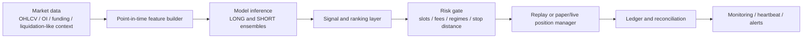

# Architecture

The private system is organized as a research-to-runtime pipeline.

## Research components

- Data normalization across symbols and timeframes.
- Point-in-time feature construction with leakage checks.
- Chronological walk-forward training and OOS replay.
- Side-specific LONG/SHORT models and calibration/ranking layers.
- Portfolio-level slot constraints and risk gates.

## Runtime components

- Exchange REST/websocket poller or equivalent market-data updater.
- Feature store / rolling context builder.
- Model inference service.
- Candidate ranking and admission gates.
- Risk engine.
- Paper/live ledger.
- Heartbeat summaries and operational logs.

The public repo documents this architecture but does not publish the production exchange adapter or credentials.
