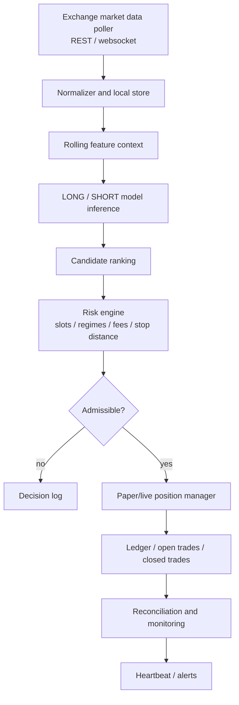

# Runtime and Monitoring

The private system includes live/paper runtime components. This repo documents the architecture but does not publish production execution code.

## Runtime flow

## Monitoring examples

The private system tracks diagnostics such as:

- poller cycle health;
- request counts and latency bands;
- stale data checks;
- candle/data integrity fill events;
- model/calibrator load status;
- candidate counts by side/regime;
- paper/live open positions;
- heartbeat summaries;
- runtime exceptions and exchange outages.

## Operational failure modes considered

- stale or missing candles;
- exchange API outages or rate limits;
- model artifact missing/mismatch;
- feature parity drift between replay and runtime;
- ledger mismatch between paper/live state and expected state;
- noisy monitoring patterns producing false alerts.

Raw logs are not published because they can contain sensitive operational details.
